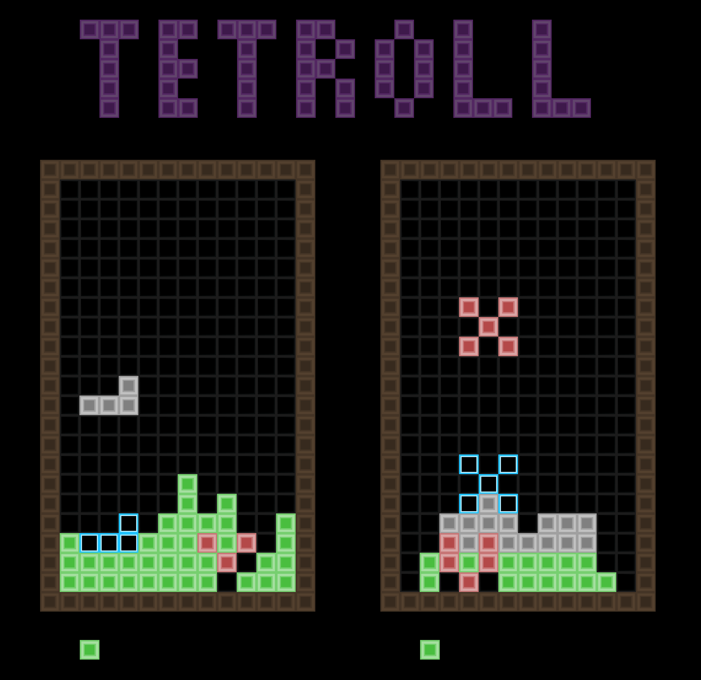

# tetroll
Block-placing trolling game for 2 players


# Install dependencies
```
pip install requirements.txt
```

Optional dependencies:  
- miniupnp(Not necessary for offline and LAN play)

# Running
For a GUI.  
```
python ./menu.py  
```
  
You can also run straight from the command line.  
That way you don't need pyqt5.  
Documentation for that is located in the HELP file.  
```
python ./tetroll.py
```
